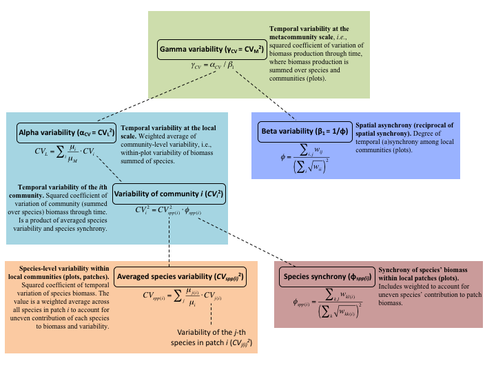

This is a quick example for using the individual functions in the patches package.

All metrics are based on Wang and Loreau (2014, Ecology Letters). Below is a schematic for how they are all related, and the equations used in the functions.



### Install and load package
Load a bunch of packages, then install `patches`. Also read in a test data set.
```{r example, echo=TRUE, message=FALSE}
# Load relevant packages
# install.packages(c("dplyr", "plyr", "reshape2", "synchrony", "devtools"))
require(plyr)
require(dplyr)
require(reshape2)
require(synchrony)
require(devtools)

# Install package from GitHub
devtools::install_github("atredennick/patches")
require(patches)


# Read in data
setwd("/Users/atredenn/Dropbox/Patches/")
species_data_kbs <- read.csv("./Data sets/AllSpData_02282015.csv")%>%
              filter(site_code=="KBS") %>%
              filter(treatment=="T0F0")
```

## Get all the different metrics
### Species synchrony
```{r spp_synch, echo=TRUE, message=FALSE}
# Start with species synchrony in each patch
phi <- species_synchrony(D = species_data_kbs)
print(phi)
```
First column is the plot id, second is species synchrony in that plot.

### Variability of j-th species in i-th plot
```{r ind_spp_var, echo=TRUE, message=FALSE}
CVji <- ind_spp_var(D=species_data_kbs)
# look at just the head...there are num_spp*num_plots lines
head(CVji)
```
Note that species that only show up once in the time series have the same CV. Here's an example of why that happens...
```{r ex, echo=TRUE, message=FALSE}
obs_anpp <- c(1:10)
num_years <- 10
for(i in 1:length(obs_anpp)){
  ts <- numeric(num_years)
  ts[1] <- obs_anpp[i]
  cv <- sd(ts)/mean(ts)
  print(cv)
}
```
So, regardless of the actual value, if there is only one observation, then the CVs are always equal.

### Averaged species variability in each plot
```{r avg_spp_var, echo=TRUE, message=FALSE}
CVspp_i <- avg_spp_var(D = species_data_kbs)
# Returns one value per plot
print(CVspp_i)
```

### Variability of community i (CV_i^2)
```{r vari, echo=TRUE, message=FALSE}
CVi_sq <- community_var(D = species_data_kbs)
# Returns one value per plot
print(CVi_sq)
```

### Alpha variability (CV_L^2)
```{r avar, echo=TRUE, message=FALSE}
CV_L <- alpha_var(D = species_data_kbs)
# Returns one value
print(CV_L)
```

### Beta variability (B_1)
```{r bvar, echo=TRUE, message=FALSE}
B_1 <- beta_var(D = species_data_kbs)
# Returns one value
print(B_1)
```

### Gamma variability (CV_M^2)
```{r gvar, echo=TRUE, message=FALSE}
CV_M <- gamma_var(D = species_data_kbs)
# Returns one value
print(CV_M)
```

